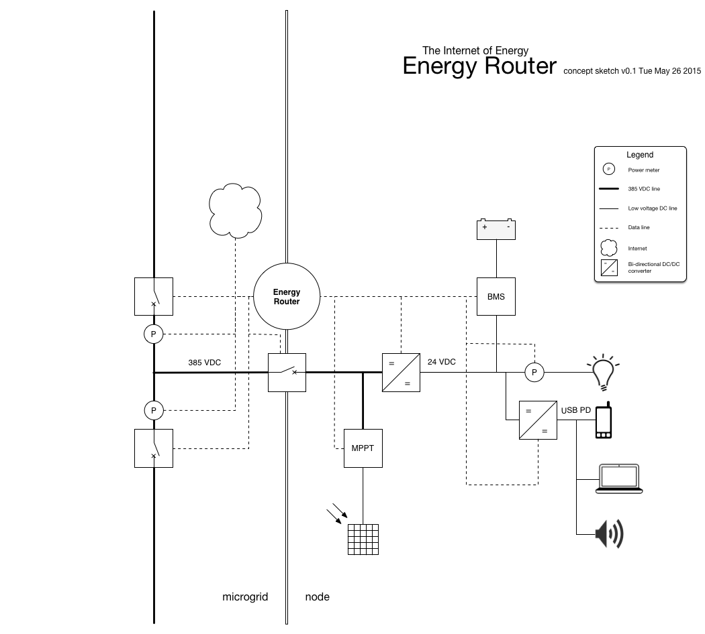
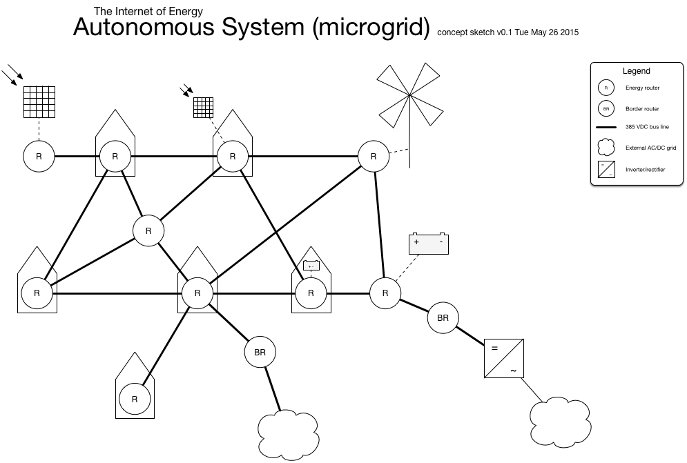

# Nailing the microgrid

Designing the Internet of Energy

## Introduction

When Nikola Tesla developed our current electrical system in the beginning of the 20th century, he meant for it to be an intermediate state between an unelectrified and a fully electrified world where energy would be shared freely. Due to market forces and perhaps his overestimation of human capacities, his vision of free, sustainable, energy for everyone was never fully realized.

Ever since we have been stuck with the prototype for an electrical system from the 1920's, requiring a fully centralized top-to-bottom design and being increasingly maladjusted to today's electrical generation, transport, storage and consumption requirements. In Tesla's time AC (alternating current) was the only way of converting electric potential from high to low voltages and vice versa, allowing for long distance transportation of energy. Moreover, as cheap abundant fossil resources where available, storage and efficiency requirements where minimal.

Nowadays, the scarcity of fossil fuels (and severe damage to the environment) make sustainable generation and the storage of their intermittent production an absolute necessity. As such, it seems that all of the significant options for sustainable energy production (wind, PV, CSP, tidal) represent essentially DC (Direct Current) sources. The same is true for storage solutions (though some production and storage solutions produce AC, this is not of a fixed frequency and requires prior DC conversion regardless). Moreover, virtually all modern household and office appliances are essentially DC devices, requiring rectifiers and DC-DC voltage conversion for each and every device.

With the current advancement of fast, reliable, cheap and efficient switching electronics (like IGBT's and power MOSFET's) together with widely available DSP's and microprocessors, the conversion of DC voltages has become at least as efficient as AC-DC or AC-AC voltage conversion, but requires less and cheaper parts. As both generation, storage, production and transport are more efficient using DC, the overall system efficiency can be significantly increased.

At the same time, a fully integrated DC grid would greatly simplify the implementation and design of smart microgrids as no powerfactors, resonances or induction losses need to be taken into account. With DC technology, units of production, storage and consumption can be seamlessly connected in an ad-hoc fashion in self-sufficient microgrids while increasing resilience and reliability.

In addition, a DC grid would be fully bidirectional and thus 'smart' from the very start, requiring only minimal management, creating the potential for small communities to manage their own sustainable electrical supply. As the current centralized AC grid architecture is fundamentally limited in the degree to which (intermittent) microgeneration can participate, moving to a full DC grid provides a fast way forward to fully renewable energy production.

In this context, we see the free spread of technology and knowledge as key factors to allow both for wealthier economies to reduce their footprint at a pace in line with environmental requirements as well as to allow developing economies to increase their standard of living with a minimal impact on the environment. Because of this, the software, hardware and overall system design and other documententation available to the general public for use, modification and re-distribution.

Nikola Tesla aimed for a globally coordinated, integrated, energy grid but failed tragically. Instead, we count on human autonomy and decentralized collaboration to allow groups of people to gradually break away from traditional AC systems by building their own, interconnected microgrids. The idea is to learn by doing, building an Internet of Energy and develop, document and refine the technology one community at a time, while retaining full interoperabiliuty with legacy AC systems, demonstrating a path for an accelerated transition to decentralized, sustainable energy.

## The Internet of Energy
Similar to the transfer of streams of data on the worldwide internet, electrical energy could be routed and transferred with very high efficiency from sources to their of destinations without central management technology. A similarly created Internet of Energy would natively exhibit self-healing properties by providing for redudancy and islanding. It would not allow for nor require central management and as such would enable communities to autonomously produce and exchange energy while maintaining control and privacy.

### How the internet works
In order to study the design of an Internet of Energy we need to first look at some of the core principles behind the design of the internet to find out how such a complex system can show such miraculous stability.

In the 1960s the DARPA, the US defense' advanced research projects agency, designed the ARPANET, a computer network able to extendably connect many individually managed computer networks. The ARPANET was designed to maintain functionality while suffering losses of many of its constituent components. It did so well that it grew out span the globe and has now been called the Internet, being a network of interconnected networks.

The internet consists of many interconnected **Autonomous Systems**. These are individually managed networks with different architectures, topologies and capacities, which are connected through so-called **Border Routers**. Within Autonomous Systems, individual systems, called **Nodes**, are connected through ordinary **Routers**. It is these fundamental design elements of the internet which we will reapply within the context of routing electrical energy.

### Routing electrical energy
In traditional systems electrical energy is distributed top-down, from a few large power plants producing energy at immense voltages down to many small houses and electricity sockets. In these situations electrical energy typically flows in a single direction, from high-voltage generation down to medium-voltage distribution down to consumption.

In distributed production scenario's, where decentralized microgeneration is the main source of energy, this is not so straight forward and energy can essentially flow in any direction. But how to get the right amount of energy in the right place, how to assure that enough energy is available and how to assure that an outage in one side of the net does not take the rest of the net with it?

### The Energy Router

Meet the Energy Router, an semi-autonomous agent able to control and measure the flow of electrical energy between and within Nodes, which represent individual units of consumption, storage and production (like households, buildings or administrative units). It essentially forms the border point between the **Internal Network** working on a lower voltage and the microgrid. The task of the Energy Router is to regulate demand and supply of energy, co-maintaining the grid's stability as well as that of the Internal Network.

The Energy Router gathers data and controls energy sources like Maximum Power Point Trackers (MPPT) for solar panels, Battery Management Systems (BMS) and communicates directly with appliances or their power supplies as well as the Energy Router's of other Nodes.

While being internet-connected the Energy Router essentially performs its tasks without, communicating with other Energy Routers by changing voltages. However, when an internet-connection is provided the Energy Routers in a network form an intelligent multi-agent system. Collectively, the routers are able to optimize storage, supply and demand by negotiating current and future (predicted) requirements and availability of energy as well as integrating external information such as weather data from third parties.

### The Autonomous System
On the Internet, an Autonomous System is an independently managed network and in The Internet of Energy this is much the same: Interconnected Nodes form Autonomous Systems that are opaque to the outside world and will function regardless of and autonomous from it.

An Autonomous System is made up of interconnected Energy Routers. Most of these connect full Nodes with an Internal Network, others will directly connect storage or generation capacity and yet others might have the task of Border Router, connecting an Autonomous System to other Autonomous Systems or to the legacy grid.

### Smart topology
The Nodes in an Autonomous System are linked over **Point to Point** connections, links between a single Energy Router and another. In this way an Energy Router can be connected to one or more other Energy Routers with a Point to Point link for every connection. As opposed to traditional grid systems, which typically have a hierarchical 'tree' structure, The Internet of Energy follows a mesh topology where any Node can be connected to any other Node, increasing flexibility, redundancy and efficiency.

### Privacy and internal accounting
Because capacity for production, storage and transport within an Autonomous System is managed by the owners, typically a community of users, the usage of the system can be expected to be fairly balanced amongst Nodes. Nevertheless, because structural imbalances add up over time, it is important to keep an accurate ledget on the balances between nodes. Especially in dense environments with continuously changing circumstances and varying degrees of trust between users, the need of authorative accounting will arise.

This task is traditionally performed by a trusted third party like a network operator, who sometimes even stores your data 'safely' and 'with respect for privacy' in 'the cloud'. However, modern blockchain technology (as pioneered by Bitcoin) allow us to perform trusted tasks in a fully decentralized manner. Because power is measured on both ends of the connection between Nodes, they are in a position to validate one anothers findings. After agreement has been reached, values are added to the Autonomous System's internal ledger (in the form of a blockchain). The numbers are then cryptographically signed so that undetected tampering becomes a mathematical impossibility.

However, because this data is managed within the Autonomous System's infrastructure, and preferably encrypted, the privacy of the users is maximally protected; from the outside only aggregate data is shared about the delivery to and from other networks through a Border Router.

### The Border Router
The border router connects one Autonomous System to another, or to legacy grids and essentially sells excess energy or buys energy when local generation and storage capacity are insufficient. This makes it an autonomous market agent, algoritmically selling and buying short-term futures based on predictions and knowledge about the state of the Autonomous System combined with market circumstances.

As such, it makes sense to allow the algorithms to occasionally sell of stored energy to perform peak-shaving services for neighbouring systems, for a profit. This could be electric vehicles selling back a fraction of their energy to power known short-term loads or households selling battery-stored energy to nearby industry during the day as plenty of wind energy is predicted during the night.

The energy market might be one of the few markets where price determination down to the millisecond could prove to be constitutive to the environment rather than deteriorative.

### Open technology
Smartgrids and sustainable technology are typically imagined in urban contexts in well-off economies, however the short term (efficiency and monetary) gains in these contexts are limited due to the amount of legacy they have to sustain (and fight) and the small gains in comfort they yield. In contrast, for many emerging markets and less fortunate societies the promise of a cheap, autonomously controlled and stable supply of electric power yields tremendous advantages.

Though often the current lack of infrastructure is the result of political and/or economic factors, sometimes technological factors might avoid these hindrances (think mobile banking in Africa, for example). Providing cheaply available, simple technology to ascertain primary services (like electricity) helps these societies’ infrastructures evolve, creating a positive feedback into the political and/or economic domain. At the same time it helps the technology grow and develop, through economies of scale and (literally) battle testing.

However, developing smart grid technology and then patenting and copyrighting it is not the way to get it adopted in economies that cannot afford to pay for the licensing costs. Developing it and waiting for Chinese clones will not aid in the further development and global economies of scale. Furthermore, it will not allow people and companies alike to produce components locally.

Developing the hardware and the software for The Energy Router, The Border Router and, eventually, the DC/DC and AC/DC converters in the public domain does. Having standardized components that are designed for flexibility and simplicity freely available for usage, modification and (re)distribution creates an enormous potential for growth of smart grid technology and hence for sustainable development and emancipation of societies.

### Modular technology
In current renewable energy systems critical components such as a battery management system (BMS), a maximumum power point tracker (MPPT), an inverter and data logging (smart metering) functionality are often integrated into a single device running proprietary firmware. This has the advantage of increased material- and cost-efficiency and integrative optimization (tuning) of the separate parts. There are, however, the risks of accelerated deprecation and difficulties in long-term maintenance.

Typical lifetimes for decentralized renewable energy systems can be expected to be 20-25 years, corresponding to the typical lifetime of photovoltaic panels. However, given the exponential trend in cost reduction as well as global application of the technology, major technological breakthroughs as well as significant cuts in their application costs can be expected for most parts of the system. This means that, similar to the exponential trend in IT, repairing devices as part of maintenance will be more expensive both in terms of monetary costs as well as in resource use due to increased efficiency.

Rather than designing one system that needs to be replaced regularly during the lifetime of the renewable energy system, risking compatibility and increased difficulty in maintenance, it would be desirable to aim for a modular approach where a single Energy Router is able to use a myriad of protocols and busses to communicate with a host of different current, future and legacy devices connected to the grid. As the core role of the Energy Router is communication with other devices, its (cheap) hardware needs to be upgraded only occasionally while its software can be continuously updated and maintained.

Instead of having a single device which cannot be extended, updated nor modified and requires proprietary knowledge to be maintained, working with generic devices allows for seamless upgrading, repairing and replacement of parts. This offers users a tremendous flexibility in the design of their energy system, being free from a vendor lock-in, potentially allowing them to do their own maintenance while still using the latest technology. Paradoxially, it would also significantly reduce the amount of hardware that gets wasted.

Similar to the way the Linux operating system allows people to still use old computers, having legacy support for older devices will allow people who would not otherwise have access to advanced renewable energy systems to use deprecated technology makes access more equitable while reducing the overall manufacturing costs.

Another comparison might be in the hifi domain. Think of how many discrete vintage amplifiers, tuners and record players are still being put to use, now compare this to the rapid decline of modern cheap integrated hifi towers from our environment. While cheaper, more compact and advanced, the integrated hifi towers with their double deck tape players, digital tuners and 12-bit CD players quickly faded away because their individual parts could not be repaired, replaced or (in case of the cassette player) simply removed altogether.
