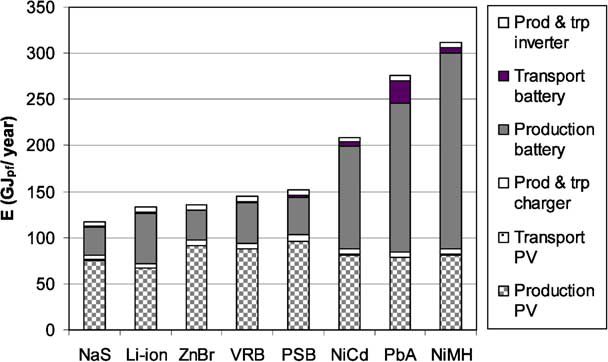
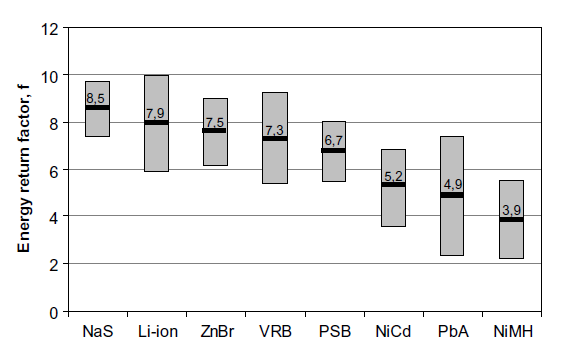

# Storage
##   Template
General description of storage technology. I.e. the first two lines of related Wikipedia article.
### Materials
* Cathode:
* Anode:
* Electrolyte:
* Other:

### Efficiency
* Storing: xx%
* Feeding back: xx% gets less efficient with high power output
* Overall: xx%

### Other features
* DoD: xx%. This is an arbitrary value, because off-course all cells can be discharged till 100%. However, most batteries have decreasing lifetimes with lower DoD.
* Cycles: # @xx%DoD (# cycles until 80% of initial capacity is left)
* Lifetime (@1000 Cycles @DoD80%): x Yr
* Lifetime (either limited by float lifetime or use @365 cycles /Yr 33%DoD: x Yr
* Energy density: xx Wh/kg
* Price: xx €/kWh
* Stage of development:
* Other:

### Sustainability
* Recycleable?
* Toxicity?
* Production energy input?
* Resource aspects?

### Companies
* Potential partner x
* Potential partner y

## Hydrogen / Seasonal storage
Only technology that is truly capable of seasonal energy storage, according to OECD-IEA Energy Technology Perspectives 2014

### Efficiency
* Best practice electrolysis efficiency: 50 to 80%
* Fuel cell efficiency: (Nedstack PEM fuel cell): 50% electrical energy, with 40% waste heat (which can theoretically be used as well)
Net theoretical efficiency: 25-40%, with an additional 20-32% reusable waste heat.

### Companies
* [SFC](http://www.sfc.com/en) (Germany), methanol (**NOT H2**)
* [Nedstack](http://www.nedstack.com/) PEM fuel cells (NL)
* [Arcola](http://www.arcolaenergy.com/) (UK)
* Electro Power Systems - their product is called the Electro Self, ranging from 1.5 - 12 kW output, with a 5.5kW electrolyzer.
* FutureE - A German company that also makes a similar system
* Acta Power - they also have a hybrid system that uses their own electrolyzer tech, but the fuel cells come from FutureE. The two companies target different markets to avoid direct competition.

### Products

[PDF Overview](http://www.fuelcelltoday.com/media/1871508/water_electrolysis___renewable_energy_systems.pdf) of fuel cell technology by FuelCellToday

## Mid-term storage
(most technical parameters about battery types are cited from Rydh, C. J. & Sandén, B.B. (2005). Energy analysis of batteries in photovoltaic system. Part I & II. _Energy Conversion and Management . 46.). Commercial datasheets usually provide more optimistic values, probably (this is an assumption) because those values are under ideal circumstances (temperature, load/charge user charactaristics etc. This paper may also be consulted if some parameters may be unclear)._

### LiFePo4

### Lead acid
Lead acid batteries are the most commenly used batteries. They can deliver a lot of instant power, but are heavy, efficiencies are relatively low, the lifetime is not very long, especially when the batteries are discharged to deep and when no full charge-discharge cycles are performed (which is not the case in a household tipically). The biggest advantage is, that they are CHEAP. However, the lower lifetime and efficiency result in a worse cost-efficiency then you would think on first sight. Lead is of f course toxic, but the advantage of lead acid batteries being mainstream, is that there is infrastructure for recycling those batteries.

Within lead acid batteries, there are mainly three types. Below those are described with some characteristics.
Wet cells (Electrolyte is fluid): High DoD, higher O&M to prevent dry-out, relatively short lifetime, lot of H2 production
Gel (electrolyte is suspended in sylica type gel): Long lifetime, lower DoD,
AGM (electrolyte is absorbed in a glass matt structure); Similar to Gel, but a bit shorter lifetime, however able to deliver higher peak output (due to lower internal resistance).

#### Materials:
* Cathode: Pb + HSO4– → PbSO4 + H+ + 2e–
* Anode: bO2 + 3H+ + HSO4– + 2e– → PbSO4 + 2H2O
* Electrolite: H2SO4

#### Efficiency
* Storing: xx% typically af low as 80% or less in last 80% of charge cycle
* Feeding back: xx%
* Overall: 70-84%

#### Other features
* Max DoD: 20-50% (Wet cells-AGM/Gel)
* Cycles: 400-1000 @80%DoD
* Lifetime (@1000 Cycles @DoD80%): 3-4 Yr
* Lifetime (either limited by float lifetime or use @365 cycles /Yr 33%DoD: 15-20 Yr
* Energy density: 15-20 Wh/kg
* Price: 1 €/kWh

#### Sustainability
* Recycleable?
* Toxicity?
* Production energy input?
* Resource aspects?

#### Companies
* [American Vanadium](http://www.americanvanadium.com/cellcube-technical-data.php) (cellcube)
* Potential partner y
>

##  Redox Flow batteries
(energy content is not limited by surface area):

### Vanadium Batteries
The **vanadium redox** (and [redox](http://en.wikipedia.org/wiki/Redox) flow) **battery** (VRB) is a type of rechargeable [flow battery](http://en.wikipedia.org/wiki/Flow_battery) that employs [vanadium](http://en.wikipedia.org/wiki/Vanadium) ions in different oxidation states to store chemical potential energy.[[2]](http://en.wikipedia.org/wiki/Vanadium_redox_battery#cite_note-2) The vanadium redox battery exploits the ability of [vanadium](http://en.wikipedia.org/wiki/Vanadium) to exist in solution in four different [oxidation states](http://en.wikipedia.org/wiki/Oxidation_state), and uses this property to make a battery that has just one electroactive element instead of two.

#### Materials:
* Cathode: In solution: V2+ <> V3+
* Anode: In solution: V4+ <> V5+
* Electrolyte: --

#### Efficiency
* Storing: xx%
* Feeding back: xx%
* Overall: 60-80%

#### Other features
* Max DoD: xx%
* Cycles: # @xx%DoD
* Lifetime (@1000 Cycles @DoD80%): 3-4 Yr
* Lifetime (either limited by float lifetime or use @365 cycles /Yr 33%DoD: 15-20 Yr
* Energy density: 15-20 Wh/kg
* Price: xx €/kWh

#### Sustainability
* Recycleable?
* Toxicity?
* Production energy input?
* Resource aspects?

#### Companies
* [American Vanadium](http://www.americanvanadium.com/cellcube-technical-data.php) (cellcube)
* Potential partner y

## Hybrid Flow batteries
(Two electrodes, energy content is limited by surface area):

### Hybrid Manganese Batteries

#### Materials:
* Cathode; Manganese Oxide
* Anode: Carbon Composite
* Electrolyte: Sodium Sulfate
* Other: Synthetic Cotton Separator

#### Efficiency
* Storing: xx%
* Feeding back: xx%
* Overall: ~80% (scientific report) 90% (aquion supplier)

#### Other features
* DoD: 100%
* Cycles: # @xx%DoD
* Lifetime (@1000 Cycles @DoD80%): x Yr
* Lifetime (either limited by float lifetime or use @365 cycles /Yr 33%DoD: x Yr
* Energy density: xx Wh/kg
* Price: <300 $/kWh
* Stage of development: large scale demo projects realized, for sale

#### Sustainability
* Recycleable?
* Toxicity?
* Production energy input?
* Resource aspects?

#### Companies
* Hybrid aquious hybrid ion: Aquion Energy

### Hybrid Ion "seasalt" batteries
**Molten salt batteries** (including **liquid metal batteries**) are a class of [battery](http://en.wikipedia.org/wiki/Electric_battery) that uses [molten salts](http://en.wikipedia.org/wiki/Molten_salt) as an [electrolyte](http://en.wikipedia.org/wiki/Electrolyte) and offers both a high[energy density](http://en.wikipedia.org/wiki/Energy_density) and a high [power density](http://en.wikipedia.org/wiki/Power_density).

#### Materials:
* Cathode;
* Anode:
* Electrolyte:
* Other:

#### Efficiency
* Storing: xx%
* Feeding back: xx%
* Overall: ~90%

#### Other features
* DoD: 90%
* Cycles: 7000 @xx%DoD
* Lifetime (@1000 Cycles @DoD80%): x Yr
* Lifetime (either limited by float lifetime or use @365 cycles /Yr 33%DoD: x Yr
* Energy density: 30-40 Wh/kg
* Price: towards 100 €/kWh
* Stage of development: Possible to buy more expensive demo packs, based in NL
* Other: High working temperature

#### Sustainability
* Recycleable?
* Toxicity?
* Production energy input?
* Resource aspects?

#### Companies
* [Dr. Ten](http://www.drten.nl/zeezout-batterij/)
* Potential partner y
* [Aquion](http://www.aquionenergy.com/) (the only [cradle2cradle certified](http://www.c2ccertified.org/products/registry/search&keywords=batterij) battery) [M100-LS83](http://www.c2ccertified.org/products/registry/search&keywM100-LS83) [M100-L083 Prelim Tech Info Sheet.pdf](https://www.dropbox.com/s/0iunm5uunfiaaor/M100-LS83%20M100-L083%20Prelim%20Tech%20Info%20Sheet.pdf?dl=0)

## Electric vehicles

## Short-term storage
### Fly-wheel
<Please describe>
[http://www.velkess.com/](http://www.velkess.com/)
type: [Velkess L](http://www.velkess.com/products)
Drop in replacement for lead acid battery packs. 3kW-15kWh - $6,000
[http://www.velkess.com/VelkessLDatasheet.pdf](http://www.velkess.com/VelkessLDatasheet.pdf)

type: Velkess A
Power: 3kVA | Energy: 15kWh | Size: 40”x40”x40” | Weight: 750lbs
Round Trip Efficiency: >=80% | Depth of Discharge: 100%
Connectivity: 200-260VAC – 48-63hz – Single Phase
Price: $7,500 – Reservation Deposit $150.
[http://www.velkess.com/VelkessADatasheet.pdf](http://www.velkess.com/VelkessADatasheet.pdf)

## Energy Storage and LCA
### Energy
Storage solutions, as many other hi-tech products, need a lot of energy to be produced. Therefore it is important to take the energy inputs and estimated savings into acount.

A good way to express the energy performance for off-grid purposses is by using the [energy return factor](https://www.dropbox.com/s/yrzqojzh7ubbdu6/Energy%20analysis%20of%20batteries%20in%20PV%20systems.%20Part%20II%20energy%20return%20and%20overall%20efficiencies.PDF?dl=0), which is usually the ratio between the replaced fossil energy and the fossil energy required to produce the whole energy production and storage system. For on-grid applications local storage has to be compared with the grid, which is the alternative for storage at schoonschip. We could define those calculations further in another stage of this project.

For now we only take into acount the energy inputs of certain battery technologies of a system. Redox flow batteries (NaS, VRB) score pretty good, especially on the production of the battery. Lithium-ion batteries need abit more energy to produced, but require less PV (or other energy inputs) due to the higher efficiencies.

Figure 1: Energy inputs for different parts of a battery-PV system using different battery technologies.

The energy return factor for different battery-PV systems is given in the graph below. This is just to give a general idea. In this case a battery-PV system is compared to a system on a dieselgenerator, which is less efficient than the grid.

Figure 2: Energy return factor for different battery-PV systems.

### Recycling
### Toxicity
Vanadium?

## Other methods for fitting supply and demand

### Demand Side Management

### Multi-sourcing

### Central electricity grid
The grid structured right now to take up surplus consumption at payment rates. This _saldering_ arrangement is likely not going to last long-term, possibly adjusting to rates similar to the ones in Germany (German households currently pay around $400/MWh for electricity and receive around $180/MWh as feed-in tariff for solar power fed back into the grid) Ideally, it would serve as a back-up

Also see:
[Matching supply and demand](https://dcgrid.hackpad.com/Unrzkurknam)
